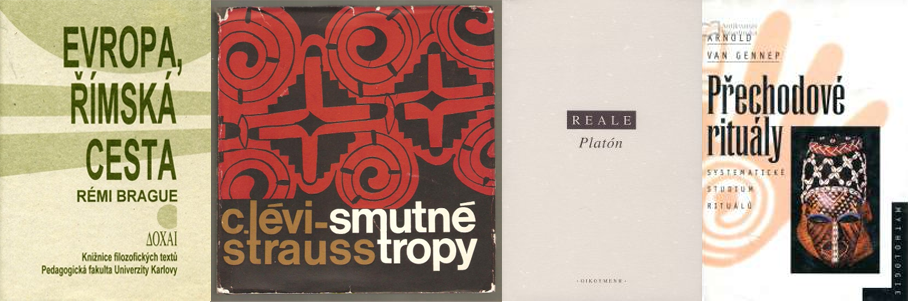

# Zpět na [Oikumena](http://oikumena.cz/) #
   
##   
   
- [Rozvrh](#Rozvrh)
- [Informace](#Informace)
- [Aktuality](#Aktuality)
- [Události](#Udalosti)
   
***
   
# Rozvrh přednášek doc. Pince
**Kořeny evropské tradice I.** , Po 8:00 (Y1034)   
**Úvod do fenomenologie III. - Jan Patočka**, Po 12:30 (Y5021)   
**Oikoumenou časem a prostorem I.**, Po 14:00 (Y1034)    
**Úvod do humanitních věd a studia vzdělanosti**, 1.10.2017, 15.10.2017, 5.11.2017, 19.11.2017, 3.12.2017, 7.1.2017   
   
***
   
# Informace #  
* Registrace docházky: [http://tiny.cc/dochazkaregistrace](http://tiny.cc/dochazkaregistrace)    
* [Facebooková skupina Doc. Pince k jeho přednáškám](https://www.facebook.com/groups/OikumenouCasemaProstorem)   
   
***
   
# Aktuality  
   
## KETI - doporučené knihy z první hodiny: ##   
- BRAGUE, Rémi. Evropa, římská cesta. Praha: Pedagogická fakulta UK, 1994.   
- LÉVI-STRAUSS, Claude. Smutné tropy. Přeložil Jiří PECHAR. Praha: Odeon, 1966/2011.   
- REALE, Giovanni. Platón. Přeložil Martin Cajthaml. Praha: Oikoymenh, 2005.   
- VAN GENNEP, Arnold. Přechodové rituály: systematické studium rituálů. Přeložil Helena BEGUIVINOVÁ. Praha: Lidové noviny, 1997.   

***
   
# Události #

   
## #1. Péče o duši - Platón a Aristoteles (#metauvod) ##   
_1. října 2017 (Neděle) v 9:30h_   
_odkaz FB: [Péče o duši - Platón a Aristoteles](https://www.facebook.com/events/354175528354587/?acontext=%7B%22source%22%3A4%2C%22action_history%22%3A%22null%22%7D&source=4&action_history=null)_
   
__Četba k přednášce a na seminář:__   
1) Kapitola 10, Transformace ontologického projektu u Aristotela. PATOČKA, Jan. Péče o duši II: Stati z let 1970-1977. Praha: Oikoymenh, 1999, s. 314-326   
   
2) Kapitola 11, Pohyb péče o duši u Platóna a Aristotela. PATOČKA, Jan. Péče o duši II: Stati z let 1970-1977. Praha: Oikoymenh, 1999, s. 327-355.

3) Doc. Pinc doporučuje zopakovat si dějiny Řecka. Lehké a zábavné čtení je 📙Schwanitz - Vzdělanost jako živý dialog s minulostí, str 37-77 (kapitolky "Klasická antika" a "Dvě kultury, dva národy, dva texty"). PDF naleznete v Moodle->Uvodní kurzy a cykly-> "Schwanitz 1. část ke kolokviu".   
   
Čítanka: [http://tiny.cc/uvod1](http://tiny.cc/uvod1)   
Přehled všech přednášek [http://tiny.cc/uvodprehled](http://tiny.cc/uvodprehled)    
Registrace docházky: [http://tiny.cc/dochazkaregistrace](http://tiny.cc/dochazkaregistrace)    
   
   
   
   
***
#### Minulé
* [#1 metaúvod - Péče o duši - Platón a Aristoteles](https://www.facebook.com/events/354175528354587/?acontext=%7B%22source%22%3A4%2C%22action_history%22%3A%22null%22%7D&source=4&action_history=null)

   __1. října (Neděle) v 9:30h__
   
* [#3 Prázdninové setkání u doc. Pince](https://www.facebook.com/events/275659666248331/)

   __3. září 2017 (Neděle) v 10:30h__
      
* [#2 Prázdninové setkání u doc. Pince](https://www.facebook.com/events/1627546073924610/)

   __22. července 2017 v 10:30h__

* [#1 Prázdninové setkání u doc. Pince](https://www.facebook.com/events/1463509360339210/)

   __11. června 2017 v 10:00h__

* [Nedělní škola - doc. Pinc - Přišimasy](https://www.facebook.com/events/1564334846941729/)

  __14. května 2017 (Neděle) v 10:30h__

* [Nedělní škola - doc. Pinc](https://www.facebook.com/events/1915169085397014/)

  __23. dubna 2017 (Neděle) v 10:30h__
